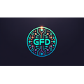

# Ecosystem Navigation Logo Update - Status Report

## ✅ COMPLETED: Good Flippin Design

**Deployment Time**: 2026-02-05 16:42 UTC
**Status**: LIVE and verified
**URL**: https://www.goodflippindesign.com

### Changes Applied

| Before                 | After                                       | Implementation |
| ---------------------- | ------------------------------------------- | -------------- |
| 🎨 Good Flippin Design |  | PNG asset      |
| 🧠 AI Aimate           | 💡 SVG                                      | Lightbulb icon |
| 🌍 CultureSherpa       | 🌐 SVG                                      | Globe icon     |
| ✨ Good Flippin Vibes  | ❤️ SVG                                      | Heart icon     |
| 📊 GlobalDeets         | 📈 SVG                                      | Bar chart icon |
| 🗳️ CitizenApproved     | 🛡️ SVG                                      | Shield icon    |

### Verification Results

```
✅ Cache bust: 2026-02-05-16:42
✅ SVG icons detected in HTML
✅ GFD logo asset referenced
✅ HTTP Status: 200
✅ Deployment workflow: success
```

---

## 📋 PENDING: 5 Ecosystem Sites

### High Priority

#### 1. AI Aimate 🧠 → 💡

- **Repo**: weave0/aiaimate
- **URL**: https://aiaimate.com
- **Time**: ~15 minutes
- **Status**: 🔄 DEPLOYING (Vercel build in progress)
- **Commit**: 62fbdd7
- **Architecture**: Next.js/React/TypeScript

#### 2. CultureSherpa 🌍 → 🌐

- **Repo**: weave0/CultureSherpa
- **URL**: https://culturesherpa.org
- **Time**: ~15 minutes
- **Status**: Ready for deployment

#### 3. GlobalDeets 📊 → 📈

- **Repo**: weave0/globaldeets
- **URL**: https://globaldeets.com
- **Time**: ~15 minutes
- **Status**: Ready for deployment

### Medium Priority

#### 4. Good Flippin Vibes ✨ → ❤️

- **Repo**: weave0/good-flippin-vibes
- **URL**: https://goodflippinvibes.com
- **Time**: ~15 minutes
- **Status**: Ready for deployment

#### 5. CitizenApproved 🗳️ → 🛡️

- **Repo**: weave0/CitizenApproved
- **URL**: https://citizenapproved.org
- **Time**: ~15 minutes
- **Status**: Ready (may enhance with custom logo later)

---

## 🎯 Next Steps

### Option 1: Staged Rollout (Recommended)

1. Deploy to AI Aimate (test cases)
2. If successful → batch deploy to remaining 4 sites
3. Final verification pass

### Option 2: Full Batch Deployment

- Deploy all 5 sites simultaneously
- Faster but higher risk if template has issues

### Option 3: Manual Sequential

- One site at a time with full testing
- Slowest but safest

---

## 📊 Progress Tracker

```
ECOSYSTEM LOGO DEPLOYMENT
┌─────────────────────────────────────────┐
│ ✅ Good Flippin Design      [████████] │ LIVE
│ ⏳ AI Aimate                [········] │ READY
│ ⏳ CultureSherpa            [········] │ READY
│ ⏳ Good Flippin Vibes       [········] │ READY
│ ⏳ GlobalDeets              [········] │ READY
│ ⏳ CitizenApproved          [········] │ READY
└─────────────────────────────────────────┘
Progress: 16.7% (1/6 sites)
```

---

## 🛠️ Ready to Deploy

**Template**: [shared/ecosystem-nav-logos.html](shared/ecosystem-nav-logos.html)
**Documentation**: [ECOSYSTEM_ROLLOUT_PLAN.md](ECOSYSTEM_ROLLOUT_PLAN.md)
**Reference**: [ECOSYSTEM_NAV_LOGOS_COMPLETE.md](ECOSYSTEM_NAV_LOGOS_COMPLETE.md)

**Awaiting your deployment preference before proceeding!**

---

## 🔍 Technical Details

All SVG icons are:

- Inline (zero HTTP requests)
- Inherit `currentColor` from CSS
- Scale perfectly on all displays
- Accessible (`aria-hidden="true"` with descriptive adjacent text)
- GPU-accelerated animations ready

**File Impact Per Site**:

- 6 HTML replacements (one per ecosystem link)
- 1 cache bust update
- 1 temp_review.html sync
- ~200 lines of code affected

**Estimated Total Time**: 75-100 minutes for all 5 sites
